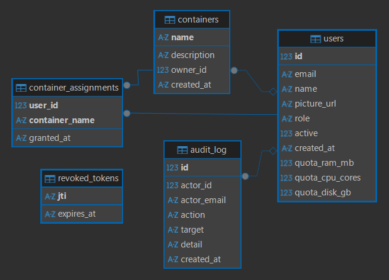

# Hobby Server Monitor (HSM)

HSM is a lightweight, secure-by-default web dashboard for managing LXD containers on small homelab servers. It is specifically designed to run efficiently on low-resource hardware (like WSL2, Raspberry Pi, or burstable cloud instances) without the heavy memory overhead of enterprise monitoring solutions. 

Built with a radically decoupled architecture, HSM guarantees instant dashboard load times regardless of how many containers are running, while maintaining a strict security boundary between the web server and the LXD daemon.

---

## Key Features
- **O(1) Dashboard Loads**: The API reads a lock-free JSON cache, ensuring dashboard metrics load instantly without waiting for LXD.
- **Micro-Footprint**: The entire Python backend and metric collector consume less than 150MB of RAM combined.
- **Secure by Default**: Integrates Google OAuth 2.0, dual-cookie JWTs, strict RBAC, and systemd hardening. No passwords to manage.
- **Immutable Audit Log**: Every container lifecycle action and user assignment is permanently recorded.
- **Nightly Compaction**: The SQLite Time-Series Database (TSDB) automatically rolls up 10-second raw data into hourly averages, guaranteeing storage will not infinitely expand.

---

## Architecture


**The Decoupled Philosophy:**
The system is split into two independent components:
1. The **Collector Daemon** runs an infinite loop in the background, querying the LXD socket every 15 seconds. It writes the instantaneous state to a lightweight `live_cache.json` file and appends historical data to a SQLite TSDB (`metrics.db`). This ensures LXD is only queried O(1) times per cycle, regardless of active user sessions.
2. The **Falcon API** (served by Gunicorn) reads the `live_cache.json` for live metrics. It never accesses the LXD socket for metrics, guaranteeing O(1) read latency for the web dashboard.

---

## Installation & Deployment

This guide provides comprehensive instructions for deploying HSM to a fresh Ubuntu server. Following these steps sequentially will yield a fully functioning, secure dashboard.

### Prerequisites
- Fresh Ubuntu Server (or WSL2).
- Node.js 20.x and Python 3.10+.
- LXD installed and initialized (`sudo snap install lxd && sudo lxd init --auto`).
- Nginx installed (`sudo apt install nginx`).

### Step 1: System Preparation
Create a dedicated, unprivileged system user (`hsm`) and grant it access to the LXD socket. Next, initialize the application directories.

```bash
# Create the application and secrets directories
sudo mkdir -p /opt/hsm /etc/hsm
sudo chown -R $USER:$USER /opt/hsm /etc/hsm

# Create the dedicated unprivileged system user
sudo useradd -r -s /bin/false hsm

# Grant the user access to the LXD unix socket
sudo usermod -aG lxd hsm

# Clone the repository
git clone https://github.com/RoboticGen/hobby-server-monitor-YasasBanuka.git /opt/hsm
```

### Step 2: Build the Application
Compile the Astro frontend and prepare the Python virtual environment.

```bash
# Build the Frontend (Static HTML/JS/CSS)
cd /opt/hsm/frontend
npm ci
npm run build

# Setup the Backend (Python Falcon API)
cd /opt/hsm/backend
python3 -m venv venv
source venv/bin/activate
pip install -r requirements.txt
```

### Step 3: Secrets & Configuration
Create the environment variable file. This file must be kept outside the git repository to maintain security.

```bash
sudo cp /opt/hsm/backend/.env.example /etc/hsm/hsm.env
sudo chown root:root /etc/hsm/hsm.env
sudo chmod 600 /etc/hsm/hsm.env
sudo nano /etc/hsm/hsm.env
```
*You must populate `JWT_SECRET`, `GOOGLE_CLIENT_ID`, and `GOOGLE_CLIENT_SECRET` in this file before proceeding.*

### Step 4: Systemd Daemons
The API and the Collector run as separate systemd services, highly restricted using systemd security directives (e.g., `ProtectSystem=strict`, `PrivateTmp=yes`).

```bash
# Create the data directory and assign ownership to the hsm user
sudo mkdir -p /opt/hsm/backend/data
sudo chown -R hsm:hsm /opt/hsm/backend/data

# Install the service files
sudo cp /opt/hsm/systemd/*.service /etc/systemd/system/
sudo systemctl daemon-reload

# Enable and start the services
sudo systemctl enable --now hsm-api hsm-collector
```

### Step 5: Nginx Reverse Proxy
Finally, configure Nginx to serve the static frontend files and proxy API requests to Gunicorn.

```bash
# Create the Nginx configuration
sudo nano /etc/nginx/sites-available/hsm
```

Paste the following configuration:
```nginx
server {
    listen 80;
    server_name _; # Replace with your domain if using HTTPS
    
    # Serve static frontend files
    location / {
        root /opt/hsm/frontend/dist;
        index index.html;
        try_files $uri $uri/ /index.html;
    }
    
    # Proxy /api requests to Gunicorn
    location /api/ {
        proxy_pass http://127.0.0.1:8000;
        proxy_set_header Host $host;
        proxy_set_header X-Real-IP $remote_addr;
        proxy_set_header X-Forwarded-For $proxy_add_x_forwarded_for;
        proxy_set_header X-Forwarded-Proto $scheme;
    }
}
```

```bash
# Enable the site and restart Nginx
sudo ln -s /etc/nginx/sites-available/hsm /etc/nginx/sites-enabled/
sudo rm /etc/nginx/sites-enabled/default
sudo systemctl restart nginx
```

**Success!** Navigate to the server's IP address in your browser. When you log in with the Google account that matches the `BOOTSTRAP_ADMIN_EMAIL` in your `.env` file, you will automatically be granted Root Admin privileges.

---

## Configuration Reference

All backend configuration is managed via `/etc/hsm/hsm.env`. 

| Variable | Default / Example | Description |
|---|---|---|
| `JWT_SECRET` | *(Required)* | HS256 secret key. The application will fail to start if empty. |
| `JWT_EXPIRY_SECONDS` | `28800` (8 hours) | Lifetime of the session cookie. |
| `BOOTSTRAP_ADMIN_EMAIL` | *(Optional)* | The Google email address that will be granted Admin on first login. |
| `GOOGLE_CLIENT_ID` | *(Required)* | Google Cloud OAuth Client ID. |
| `GOOGLE_CLIENT_SECRET` | *(Required)* | Google Cloud OAuth Client Secret. |
| `GOOGLE_REDIRECT_URI` | `http://localhost:8000/api/auth/callback`| Must exactly match the Authorized URI in Google Cloud Console. |
| `RESEND_API_KEY` | *(Optional)* | Resend API key for sending email invitations to new users. |
| `RESEND_FROM_EMAIL` | *(Optional)* | Sender email address for invitations (e.g., `admin@hsm.com`). |
| `LXD_MODE` | `real` | Use `mock` for local Windows/macOS development without a Linux LXD daemon. |
| `COLLECTOR_INTERVAL_SECONDS` | `15` | Polling interval for the LXD daemon in seconds. |
| `METRICS_RAW_DAYS` | `7` | Days to retain 10-second raw data before nightly compaction. |
| `COOKIE_SECURE` | `false` | Set to `true` in production to enforce HTTPS-only cookies. |
| `DB_PATH` | `data/app.db` | Path to the metadata and auth SQLite database. |
| `TSDB_PATH` | `data/metrics.db` | Path to the time-series SQLite database. |
| `LIVE_CACHE_PATH` | `data/live_cache.json` | Path to the lock-free JSON cache for instant metric reads. |
| `LXD_TIMEOUT` | `120` | Timeout (seconds) for LXD API calls to prevent hanging on unresponsive daemons. |
| `HOST` | `0.0.0.0` | Bind address for the Falcon/Gunicorn server. |
| `PORT` | `8000` | Port for the Falcon/Gunicorn server. |

---

## Data Model



The application relies purely on SQLite in WAL (Write-Ahead Logging) mode, preventing write contention between the API and Collector.

### Metadata (`app.db`)
- **`users`**: Stores OAuth profiles, roles (`admin` or `user`), and resource quotas (`quota_ram_mb`, `quota_cpu_cores`, `quota_disk_gb`).
- **`containers`**: Supplements LXD data by mapping containers to users.
- **`container_assignments`**: Junction table granting specific non-admins access to specific containers.
- **`audit_log`**: Immutable ledger of all destructive actions (`container.create`, `user.delete`, etc.).
- **`revoked_tokens`**: Tracks invalidated JWT `jti` claims to support immediate logout validation.

### Time-Series Database (`metrics.db`)
- **`container_metrics`**: High-resolution (10-second interval) snapshots written by the Collector daemon.
- **`container_metrics_hourly`**: Low-resolution rollups. A nightly scheduled function in the Collector daemon groups the raw data by hour, averages it, inserts it here, and deletes raw data older than `METRICS_RAW_DAYS` to bound disk growth.

---

## API Reference

HSM provides a strict, RESTful JSON API. All routes are prefixed with `/api`.

### Authentication
| Endpoint | Method | Auth | Description |
|---|---|---|---|
| `/auth/login` | GET | None | Generates OAuth redirect URL to Google and sets `hsm_oauth_state` cookie. |
| `/auth/callback` | GET | None | Validates Google code against CSRF state and issues `hsm_session` JWT cookie. |
| `/auth/logout` | POST | Any User | Revokes JWT `jti` in database and clears cookies. |

### Container Management
| Endpoint | Method | Auth | Description |
|---|---|---|---|
| `/containers` | GET | Any User | Admins see all. Users see assigned. Returns live container state. |
| `/containers` | POST | Admin | Creates container. Validates RAM/CPU against host capacity & user quota. |
| `/containers/{name}` | GET | User | Gets single container. Returns 403 (not 404) for unauthorized users. |
| `/containers/{name}` | PATCH | Admin | Lifecycle actions (`start`, `stop`) and resource resizes (`ram_mb`). |
| `/containers/{name}` | DELETE | Admin | Force deletes a container. Returns 409 if currently assigned to a user. |
| `/containers/{name}/exec`| POST | User | Runs a command inside the container. Uses `shlex.split` to prevent shell injection. |

### Metrics & Accounting
| Endpoint | Method | Auth | Description |
|---|---|---|---|
| `/metrics/live` | GET | Any User | Reads `live_cache.json` file. O(1) response time. |
| `/metrics/{name}/history` | GET | User | Reads `metrics.db`. Supports dynamic ranges (`15m`, `24h`, `30d`) and bucketing. |
| `/accounting` | GET | Admin | Returns host capacity vs. allocated, and per-user quota vs. allocated. |
| `/audit` | GET | Admin | Returns the immutable audit log entries. |

---

## Security & Threat Model

HSM is designed with a defense-in-depth approach, treating the network and user input as hostile.

### 1. OAuth 2.0 & Dual-Cookie JWTs
We rely entirely on Google OAuth 2.0 to avoid storing passwords. 
- The OAuth flow uses a cryptographically random `state` token stored in a `SameSite=Lax` cookie to prevent Cross-Site Request Forgery (CSRF) during the Google callback redirect.
- The session JWT is stored in an `HttpOnly; SameSite=Strict` cookie, rendering it immune to Cross-Site Scripting (XSS) exfiltration and standard CSRF attacks.

### 2. The LXD Privilege Decision
The LXD Unix socket (`/var/snap/lxd/common/lxd/unix.socket`) requires caller membership in the `lxd` group. This is effectively root-equivalent (an attacker can mount the host `/` inside a privileged container). 

**Mitigation Strategy:** We explicitly do not run the web server as `root`. The server runs as a dedicated, unprivileged `hsm` user added to the `lxd` group. While this does not eliminate the underlying LXD privilege risk, it prevents standard Remote Code Execution (RCE) vulnerabilities in the web framework from instantly compromising the host kernel or file system. We further sandbox the daemon using systemd `ProtectSystem=strict` and `PrivateTmp=yes`.

### 3. Container Configuration Validation
The `/api/containers` POST endpoint is the authoritative security boundary. 
- Container names are enforced against a strict regex to prevent traversal or injection.
- Security-sensitive LXD config keys (`security.privileged`, `raw.lxc`) are hard-blocked via a frozenset.
- Command execution (`/exec`) uses `shlex.split()` to pass arguments directly to the LXD API as a list, entirely bypassing the Linux shell and eliminating shell injection vulnerabilities.

---

## Local Development

You can develop HSM on a Windows or macOS machine without needing a real LXD server. The backend includes a mock LXD client that simulates container lifecycles in memory.

1. Set `LXD_MODE=mock` in your `.env`.
2. Run the API: `gunicorn hsm.wsgi:app --reload`
3. Run the Collector: `python -m hsm.collector.main`
4. Run the Frontend: `cd frontend && npm run dev`
