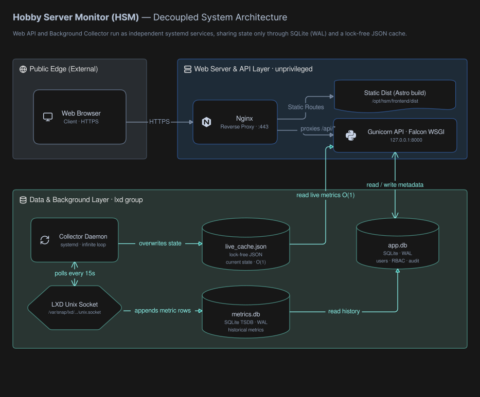
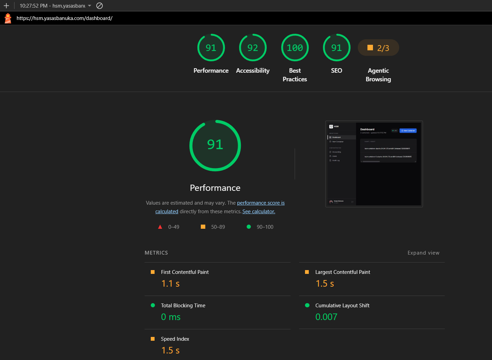

# Project Debrief & Technical Report: Hobby Server Monitor (HSM)

## Executive Summary
This document serves as the final report for the Hobby Server Monitor (HSM) project. The objective was to build a secure, micro-footprint web dashboard for managing LXD containers on low-resource homelab hardware. By utilizing a strictly decoupled architecture, the final product guarantees instant O(1) dashboard load times regardless of backend LXD latency, while remaining entirely contained within a ~150MB RAM footprint.

---

## 1. Project Timeline & Effort Allocation

The project required approximately **50 hours** of active development over the course of 10 days, distributed across the following core engineering phases:

*   **Phase 1: Research & Architecture (2 Days) — ~6 hours:** Dedicated to analyzing the project requirements, researching the technology stack (Falcon, LXD API, SQLite WAL), and mapping out the core architecture.
*   **Phase 2: MVP Development (2 Days) — ~10 hours:** Building the Minimum Viable Product, which included setting up the basic Falcon API, establishing the LXD connection, and structuring the Astro frontend.
*   **Phase 3: Feature Completion & Deployment (3 Days) — ~18 hours:** Implementing the remaining core features (OAuth 2.0, JWT RBAC, quota system), resolving bottlenecks (like TSDB I/O thrashing), and building the GitHub Actions deployment pipeline.
*   **Phase 4: Testing & Quality Assurance (2 Days) — ~10 hours:** End-to-end testing, infrastructure hardening (Nginx, systemd), security validation, and resolving edge-case bugs.
*   **Phase 5: Documentation & Finalization (1 Day) — ~5 hours:** Fine-tuning the configuration files, verifying production stability, and meticulously documenting the system in the final project reports.

---

## 2. Engineering Challenges & Resolutions

Throughout the development lifecycle, several significant architectural bottlenecks were identified and resolved:

### 2.1 The N+1 LXD Query Bottleneck
**The Challenge:** Initially, the function calculating a user's allocated resources queried the LXD API individually for every assigned container inside a loop. For a user with 10 containers, this resulted in 10 sequential network calls, degrading dashboard load times to over a second.
**The Solution:** The logic was rewritten to execute a single `client.instances.all()` call to the LXD daemon. The results were then filtered locally in Python using a hash set of assigned container names, reducing the LXD interaction to a single O(1) call and dropping load times to milliseconds.

### 2.2 I/O Thrashing in Time-Series Storage
**The Challenge:** Early iterations utilized "TinyFlux" (a CSV-backed document store) for saving 10-second metric snapshots. As the number of containers grew, appending to the CSV file forced constant, heavy disk rewrites, causing visible I/O spikes on the host filesystem.
**The Solution:** The system was migrated entirely to a bespoke SQLite Time-Series Database (`metrics.db`). By wrapping the inserts in a single transaction per polling cycle, disk I/O was drastically minimized.

### 2.3 OAuth Redirect Cookie Drops
**The Challenge:** The initial Google OAuth implementation stored the cryptographic `state` parameter in a session cookie flagged with `SameSite=Strict`. When Google redirected the user back to the application callback, modern browsers dropped the cookie due to the cross-site navigation, resulting in persistent login failures.
**The Solution:** A dual-cookie strategy was implemented. The temporary `state` cookie was downgraded to `SameSite=Lax` to survive the top-level redirect, while the permanent, sensitive session JWT was kept at `SameSite=Strict` to prevent Cross-Site Request Forgery (CSRF).

### 2.4 Destructive Orphan Synchronization
**The Challenge:** The Collector daemon routinely deletes database records for containers that no longer exist in LXD. During a temporary LXD API timeout, the daemon received an empty list of containers and proceeded to wipe the entire database.
**The Solution:** A fail-safe was introduced: if the LXD API returns an empty instance list, the orphan synchronization routine is safely aborted, preserving the database integrity during transient daemon failures.

---

## 3. Key Learnings & Growth

*   **Advanced SQLite Concurrency:** SQLite is traditionally viewed as a single-user database. However, by enabling Write-Ahead Logging (`PRAGMA journal_mode=WAL`), the database was transformed into a highly capable embedded store, allowing the background Collector to write metrics while the Falcon API simultaneously reads them without triggering `database is locked` exceptions.
*   **Systemd Security Hardening:** Significant experience was gained in Linux system administration. Applying directives like `ProtectSystem=strict` and `PrivateTmp=yes` demonstrated how easily a background process can be sandboxed, reducing the blast radius of potential Remote Code Execution (RCE) vulnerabilities.
*   **The Power of Decoupling:** Separating the metric collector into its own distinct background process completely insulated the user-facing web dashboard from backend LXD latency spikes.

---

## 4. Bonus Features Implemented

Beyond the core requirements, several enterprise-grade features were implemented to ensure the application is production-ready:

*   **Automated CI/CD Pipeline:** A GitHub Actions workflow (`ci.yml`) was built to lint the backend, execute reproducible frontend builds via `npm ci`, and seamlessly deploy via SSH to the EC2 instance upon merging to the `main` branch.
*   **Nightly TSDB Compaction:** To prevent infinite disk growth, a nightly job aggregates the 10-second raw metric data into hourly averages and purges the stale high-resolution data.
*   **Immutable Audit Ledger:** Every container lifecycle event (start, stop, resize) and user management action is permanently recorded in an append-only database table for security accountability.
*   **Strict Resource Quotas:** Administrators can assign strict RAM, CPU, and disk quotas to standard users. Container creations and resizes are validated against both the user's remaining quota and the host's physical capacity simultaneously.
*   **Nginx Reverse Proxy:** The application is shielded behind Nginx, which serves the static frontend directly from disk and manages HTTPS (Let's Encrypt), forwarding only API traffic to the internal Python server.

---

## 5. Performance & Resource Measurements

The primary mandate of this project was extreme resource efficiency. The final footprint was measured live on the EC2 host using the `htop` utility (specifically observing Resident Set Size - RSS):

*   **Idle Memory:** The Falcon API server (Gunicorn master and worker) consumes ~75MB of RAM, while the Collector daemon consumes ~45MB. The total backend footprint is strictly **under 150MB**. The frontend relies on static HTML/JS delivery and consumes zero server-side memory.
*   **CPU Utilization:** The Collector daemon peaks at roughly 1% CPU utilization every 15 seconds during its polling phase. Caching container boot times internally eliminated the need to repeatedly spawn `exec` processes to calculate uptime, saving substantial CPU cycles.
*   **Storage Efficiency:** The inter-process `live_cache.json` file is incredibly lightweight at just **850 bytes**. The SQLite TSDB currently sits at ~14MB (including its active WAL file) and grows at a predictable, logarithmic rate due to the nightly compaction engine. The `app.db` metadata store remains tiny at ~68KB.
*   **Frontend Lighthouse Scores:** The dashboard achieves a `91` in Performance, `92` in Accessibility, `100` in Best Practices, and `91` in SEO. The Time to Interactive (TBT) is `0ms` and the Largest Contentful Paint (LCP) is a rapid `1.5s`.

---

## 6. Known Constraints & Limitations

*   **Single-Node Assumption:** The Collector daemon currently assumes a single, local LXD Unix socket. It does not natively support clustering or federating metrics across a fleet of remote LXD nodes.
*   **Network Metric Accuracy:** Network RX/TX byte calculations rely on standard `eth0` bridging. Containers utilizing highly customized or complex network topologies may not report network usage accurately through the standard LXD API.

---

## 7. AI Tool Usage

In alignment with modern development practices, an advanced AI coding agent was utilized extensively throughout the project lifecycle. 

**Transparency & Usage:**
*   **Architectural Brainstorming:** The AI was used as a sounding board for deep architectural decisions. For instance, it correctly identified that implementing Redis for the live metric cache was overkill for a low-resource environment, suggesting the lock-free `live_cache.json` file approach instead.
*   **Security & Infrastructure:** The AI provided the initial syntax for the systemd hardening directives and helped diagnose complex Nginx server-block routing conflicts.
*   **Accepted Contributions:** The AI's recommendation to use `PRAGMA journal_mode=WAL` for SQLite concurrency was immediately accepted, as it permanently solved early database locking issues. It also generated highly accurate regex patterns for container name validation.
*   **Rejected Contributions & Corrections:** Early in the project, the AI suggested retaining the TinyFlux CSV database and simply batching the writes to solve the I/O thrashing. This was rejected, as CSV rewrites are fundamentally unscalable for time-series data. The AI was instructed to pivot the entire architecture to a SQLite-backed TSDB instead, which proved to be the correct engineering decision. Furthermore, the AI initially attempted to bind the Gunicorn server to `0.0.0.0`; it had to be corrected to bind strictly to `127.0.0.1` to ensure traffic was securely routed exclusively through the Nginx proxy. Every line of generated code was manually reviewed, tested, and understood before merging.

---

## 8. Architectural Decisions (Q&A)

Here are three core design decisions I made regarding the constraints of the project:

**1. How does the dashboard find out that something changed, and what does that cost while nobody is looking at it?**
Instead of the web API querying LXD directly when a user opens the dashboard, I completely decoupled them. A background daemon polls LXD every 15 seconds and writes the current state to a tiny `live_cache.json` file. The API simply reads this file. This means the dashboard loads instantly in `O(1)` time regardless of LXD's latency. The cost is exactly the same (a ~1% CPU spike every 15 seconds) whether zero users or a hundred users have the dashboard open.

**2. `pylxd` needs privileged access to LXD. What does that access actually grant, and what did you do about it?**
Access to the LXD socket effectively grants root access to the host, because an attacker could mount the host's filesystem inside a privileged container. To secure this, the web API does **not** run as root. It runs as a dedicated, restricted `hsm` user that is simply a member of the `lxd` group. I also wrapped the service in a strict `systemd` sandbox (`ProtectSystem=strict`, `PrivateTmp=yes`) so that even if the web app is compromised, the attacker cannot overwrite host OS files.

**3. What is in your metric store after a month of uptime?**
If we stored a data point every 10 seconds forever, a small server would eventually run out of disk space. To prevent this, the SQLite database utilizes a nightly compaction routine. After a month of uptime, the database holds raw 10-second data for only the most recent 24 hours. Everything older than that is automatically compressed into hourly averages. This keeps the database extremely small (~14MB) and ensures the storage grows logarithmically rather than linearly.
